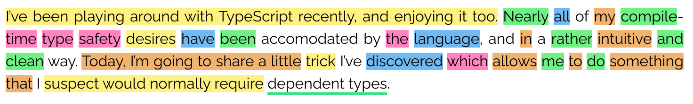
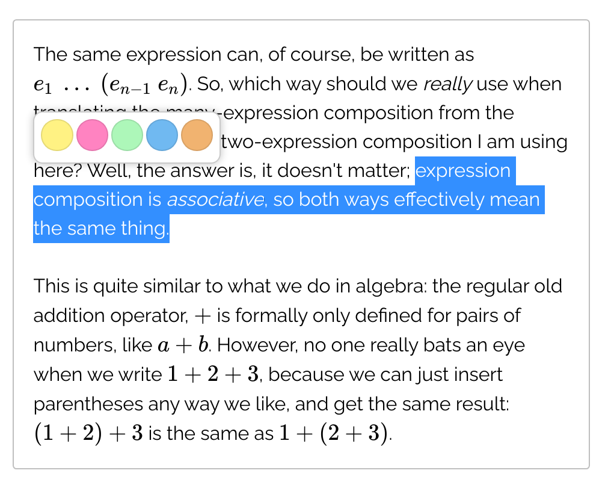
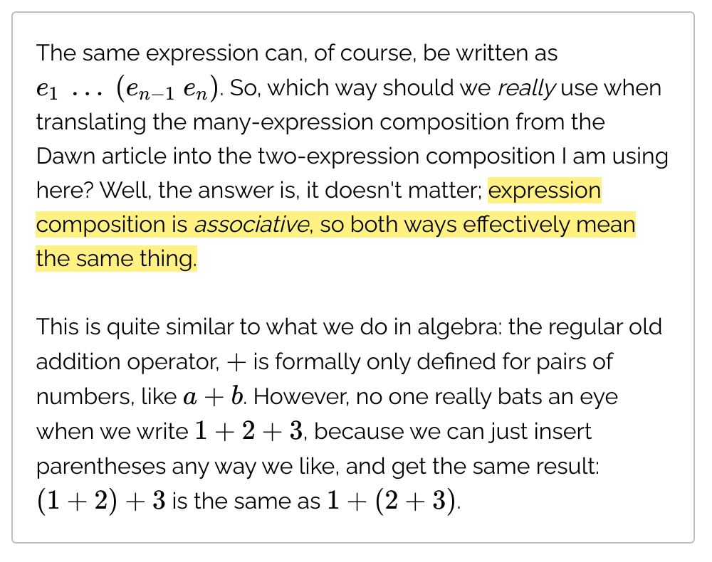
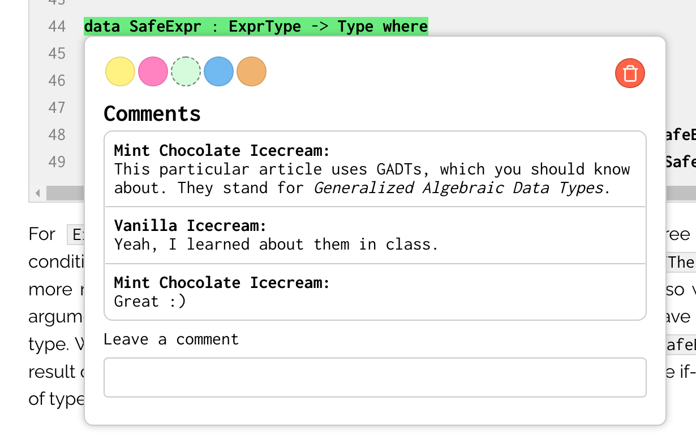
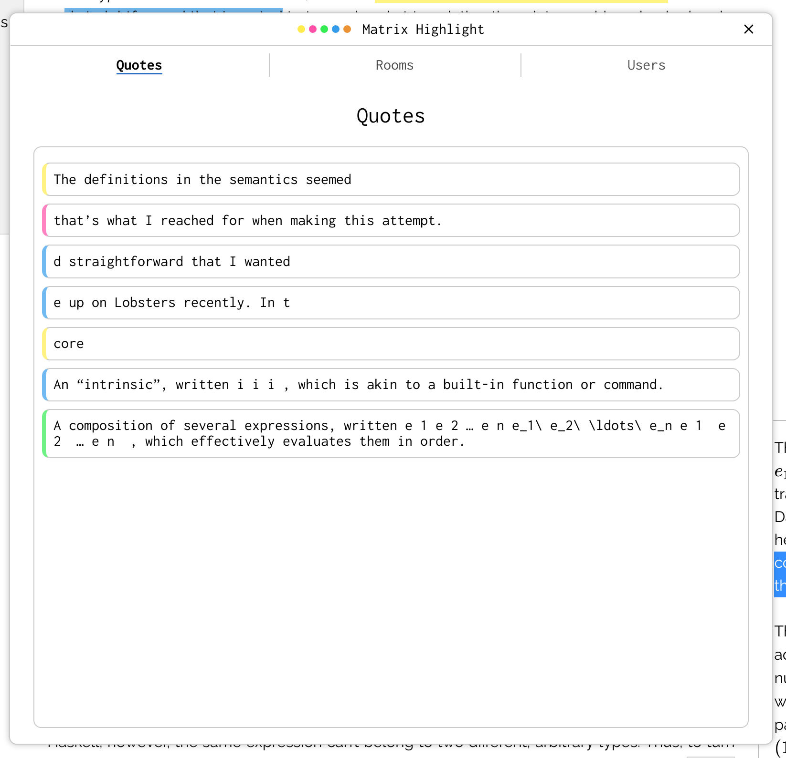
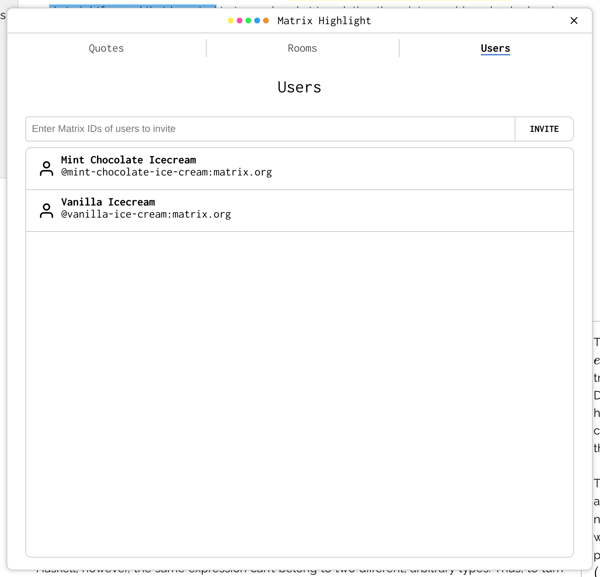
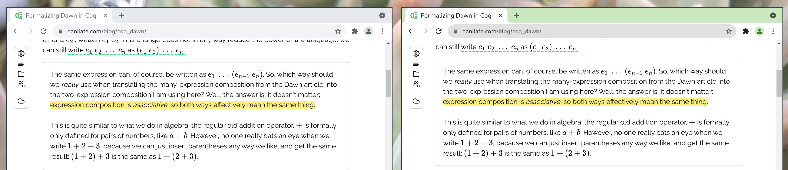

# Matrix Highlight
A decentralized and federated way of annotating the web based on [Matrix](https://matrix.org).
Watch a quick demo video below, or read the [introductory post](https://danilafe.com/blog/introducing_highlight/).
If you're on Matrix, come chat with us at [`#matrix-highlight:matrix.danilafe.com`](https://matrix.to/#/#matrix-highlight:matrix.danilafe.com).



## Features
* __Current__: Create and send website annotations over Matrix.
* __Current__: Store data in a decentralized and federated manner.
* __Current__: Share highlights with other users, including those on other servers.
* __Current__: Group annotations together and create multiple annotation groups
* __Current__: Leverage the new [`m.thread` MSC](https://github.com/matrix-org/matrix-doc/blob/gsouquet/threading-via-relations/proposals/3440-threading-via-relations.md) to allow users to comment on and discuss
* __Planned__: Use Matrix's End-to-End encryption to ensure the secure transmission and storage of highlight data.
highlights.
* __Planned__: Use something like [ArchiveBox](https://archivebox.io/) to cache the current version of a website and prevent annotations from breaking.
* __Planned__ Highlight PDFs in addition to web pages.

## Screenshots
__Selecting an expression to highlight__


__Highlighted expression__


__Highlight comments__


__Quote List View__


__User List View__


__Multi-user collaboration__


## Demo Video
https://user-images.githubusercontent.com/4361282/146517732-d3205964-7d63-4f35-baae-aeab3a9d178c.mp4

## See Also
Also check out [Populus](https://github.com/opentower/populus-viewer), which is a tool in similar spirit, but with a focus on annotating files.

## Building
The project is a handful of React applications written in TypeScript. It's sufficient to run:

```Bash
yarn install
yarn build
```

An (unpacked) extension will be available in `dist/`. Then, you can follow the [Google guide] to
install the unpacked extension in Chrome or Chromium.

### Development mode

The following command will run the Webpack in watch mode - rebuilding the extension on every change and reloading it in the browser.

```bash
yarn watch
```
